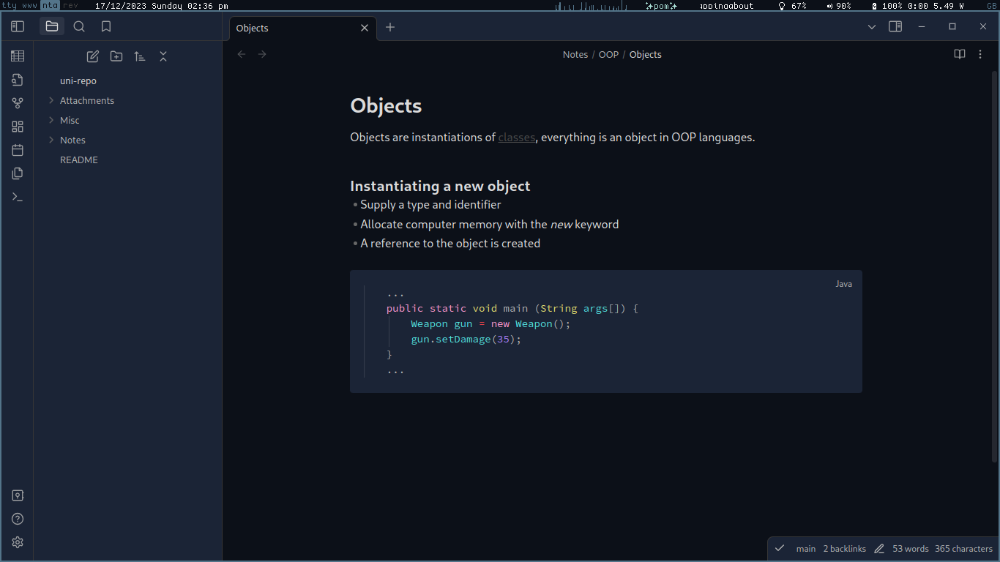

# pywal-obsidianmd

Script to install template and link it to obsidian vault. To activate, go to
Settings -> Appearance and CSS snippets are listed at the bottom.

### Preview



### Install

```
git clone https://github.com/mefwew/pywal-obsidianmd
cd pywal-obsidianmd
./install
```

### Uninstall

```
cd pywal-obsidianmd
./uninstall
```
